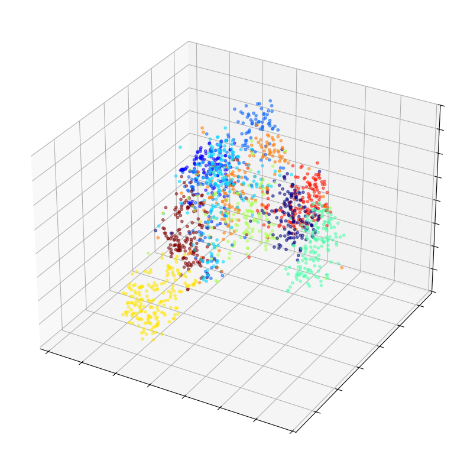

<p align="center">
    <h1 align="center">Embedding Representations for Efficient Authorship Attribution</h1>
    <p align="center">
        <strong>Benjamin Koh</strong>
        .
        <strong>Chew Jun Heng</strong>
        .
        <strong>Cheng Lin</strong>
    </p>
</p>

<p align="center">
    
</p>


This code aims to introduce a new training paradigm that first learns effective representations for downstream tasks, such as classification and information retrieval.

# Installation
1. Install the required dependencies, this could be done in a `venv` or conda enviroment
```bash
pip install -r requirements.txt
```
2. Install CuPy
```bash
# CUDA v11.2 ~ 11.8
pip install cupy-cuda11x
# CUDA v12.x
pip install cupy-cuda12x
```
More information can be found at the [installation intructions](https://docs.cupy.dev/en/stable/install.html#installing-cupy) for CuPy

3. Download the [IMDB1M Dataset](https://bridges.monash.edu/articles/dataset/Judgment_attribution_in_IMDb/28845983)
4. Run the preprocessing script, this will download the remaining datasets and preprocess them for later tasks
```bash
python preprocess_data.py
```

# Running
We first need to train model embeddings before we are able to test on further downstream tasks

## Training Embeddings
To train a embedding model, run the following command,

```bash
python train_embeddings.py -c path/to/config.yaml
```

Pre-defined configs can be found in the embeddings folder, where `bert` and `gte` refers to the respective encoder backbone. 

## Information Retrival
In this task, we attempt to retrive documents that are from the same author, to test a model on this task, run the following command,

```bash
python ir.py -c path/to/config.yaml -m path/to/model.pt
```

## Closed Set Classification
In this task, we perform classification on a closed set of authors, to test a model on this task, run the following command,

```bash
python closed_classification.py -c path/to/config.yaml -m path/to/model.pt
```

## Open Set / Zero-shot Classification
In this task, we performin classification on a open set of authors, or in a zero-shot classifcation problem. To test a model on this task, run the following command,

```bash
python open_classification.py -c path/to/config.yaml -m path/to/model.pt
```

